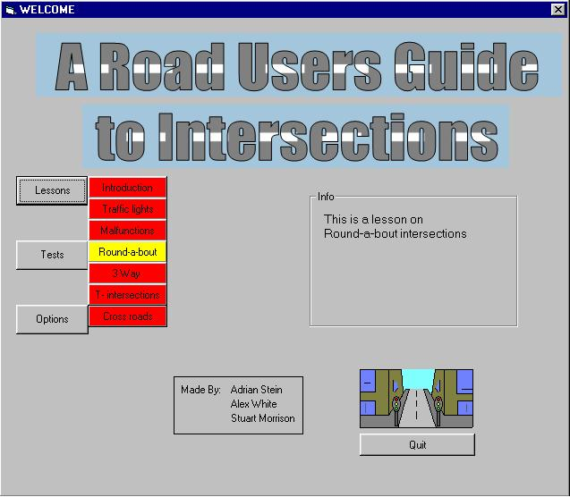



## A Road Users Guide To Intersections

### Description

To teach new drivers the rules of intersections. i made this with some hjelp from some of my friends.
 
### More Info
 
brain power

easy, comes with read me file

knowlage

??smartness??

             |
---                |---
**Submitted On**   |2004-03-02 14:55:12
**By**             |[Adrian Stein](https://github.com/Planet-Source-Code/PSCIndex/blob/master/ByAuthor/adrian-stein.md)
**Level**          |Beginner
**User Rating**    |3.0 (6 globes from 2 users)
**Compatibility**  |VB 6\.0
**Category**       |[Miscellaneous](https://github.com/Planet-Source-Code/PSCIndex/blob/master/ByCategory/miscellaneous__1-1.md)
**World**          |[Visual Basic](https://github.com/Planet-Source-Code/PSCIndex/blob/master/ByWorld/visual-basic.md)
**Archive File**   |[A\_Road\_Use1726403302004\.zip](https://github.com/Planet-Source-Code/adrian-stein-a-road-users-guide-to-intersections__1-52750/archive/master.zip)

